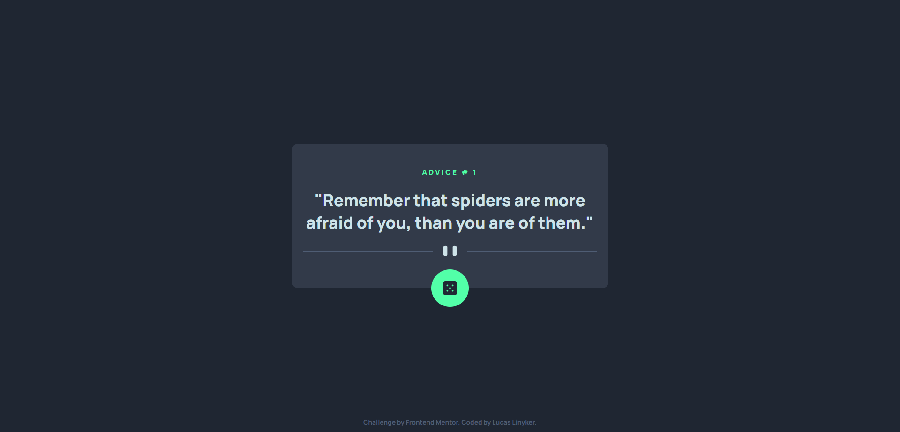

# Frontend Mentor - Advice generator app solution

This is a solution to the [Advice generator app challenge on Frontend Mentor](https://www.frontendmentor.io/challenges/advice-generator-app-QdUG-13db). Frontend Mentor challenges help you improve your coding skills by building realistic projects.

## Table of contents

- [Overview](#overview)
  - [The challenge](#the-challenge)
  - [Screenshot](#screenshot)
  - [Links](#links)
- [My process](#my-process)
  - [Built with](#built-with)
  - [What I learned](#what-i-learned)
  - [Continued development](#continued-development)
  - [Useful resources](#useful-resources)
- [Author](#author)

## Overview

### The challenge

Users should be able to:

- View the optimal layout for the app depending on their device's screen size
- See hover states for all interactive elements on the page
- Generate a new piece of advice by clicking the dice icon

### Screenshot



### Links

- Solution URL: [https://github.com/lucaslinyker/advice-generator](https://github.com/lucaslinyker/advice-generator)
- Live Site URL: [https://lucaslinyker.github.io/advice-generator/](https://lucaslinyker.github.io/advice-generator/)

## My process

### Built with

- Semantic HTML5 markup
- CSS custom properties
- Flexbox
- Mobile-first workflow
- [BEM](https://getbem.com/) - For arquiteture CSS

### What I learned

I learned how to use the fetch API to get data from an external API. I also learned how to handle errors.

Below you can see the code:

```js
try {
    const response = await fetch(apiURL);
    if (!response.ok) {
      throw new Error(`Error ${response.status} in the request!`);
    }
    const data = await response.json();
    codeAdvice.innerText = data.slip.id;
    textAdvice.innerText = `"${data.slip.advice}"`;
  } catch (error) {
    console.error(error);
    codeAdvice.innerText = error.message;
    textAdvice.innerText = "Try again!";
    codeAdvice.style.color = "red"
    textAdvice.style.color = "red"
  }
```

### Continued development

I want to continue learning about the fetch API and how to handle errors. I also want to learn more about the async/await and promises.

### Useful resources

- [Fetch api Mdn](https://developer.mozilla.org/pt-BR/docs/Web/API/Fetch_API/Using_Fetch) - This helped me to understand how to use the fetch API.

## Author

- GitHub - [lucaslinyker](https://github.com/lucaslinyker)
- Frontend Mentor - [@lucaslinyker](https://www.frontendmentor.io/profile/lucaslinyker)
- Instagram - [@lucas_linyker](https://www.instagram.com/lucas_linyker/)

[⬆ Back to top](#frontend-mentor---advice-generator-app-solution)
